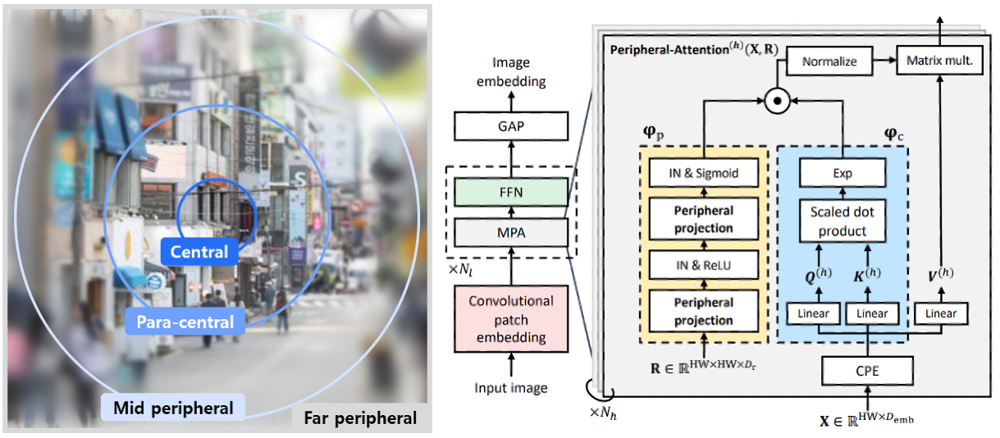
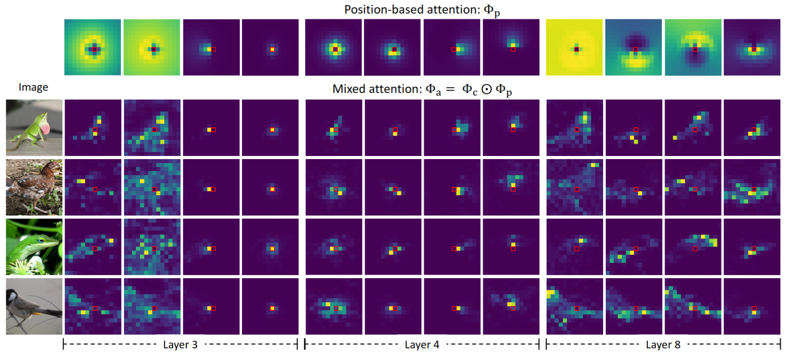
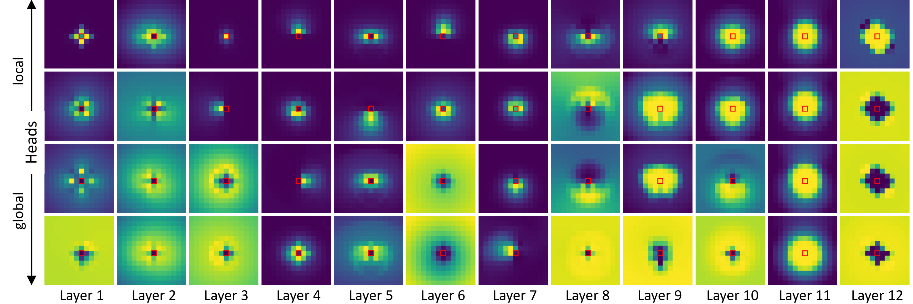

# Peripheral Vision Transformer
This is the implementation of the paper "Peripheral Vision Transformer" by Juhong Min, Yucheng Zhao, Chong Luo, and Minsu Cho. Implemented on Python 3.7 and Pytorch 1.8.1.

<p align="middle">
    
</p>
<p align="middle">
    
</p>

For more information, check out project [[website](https://cvlab.postech.ac.kr/research/PerViT/)] and the paper on [[arXiv](https://arxiv.org/abs/2206.06801)].


## Requirements
> ```bash
> conda create -n pervit python=3.7
> conda activate pervit
> 
> conda install pytorch=1.8.1 torchvision=0.9.1 cudatoolkit=10.1 -c pytorch
> conda install -c conda-forge tensorflow
> conda install -c conda-forge matplotlib
> pip install timm==0.3.2
> pip install tensorboardX
> pip install einops
> pip install ptflops
> ```

## Data preparation

Download and extract ImageNet train and val images from http://image-net.org/ (ILSVRC2012).
The directory structure is the standard layout for the torchvision [`datasets.ImageFolder`](https://pytorch.org/docs/stable/torchvision/datasets.html#imagefolder), and the training and validation data is expected to be in the `train` folder and `val` folder respectively:
> ```bash
> /path/to/imagenet/
>   train/
>     class1/
>       img1.jpeg
>     class2/
>       img2.jpeg
>   val/
>     class1/
>       img3.jpeg
>     class/2
>       img4.jpeg
> ```


## Training
To train PerViT-{T, S, M} on ImageNet-1K on a single node with 8 gpus for 300 epochs run:
> ```bash
> python -m torch.distributed.launch --nproc_per_node=8
>                                    --use_env main.py
>                                    --batch-size 128
>                                    --model pervit_{tiny, small, medium}
>                                    --weight_decay {0.03, 0.05, 0.05}
>                                    --warmup_epochs {5, 5, 20}
>                                    --drop_path {0.0, 0.1, 0.2}
>                                    --data_set IMNET
>                                    --data_path /path/to/imagenet
>                                    --output_dir /path/to/output_dir
> ```


## Evaluation
To evaluate PerViT-{T, S, M} on ImageNet-1K test set, run:
> ```bash
> python main.py --eval --pretrained 
>                --model pervit_{tiny, small, medium}
>                --data_set IMNET
>                --data-path /path/to/imagenet
>                --load /path/to/pretrained_model
>                --output_dir /path/to/output_dir
> ```
* Pretrained PerViT-{T, S, M} is available at this [[link](https://drive.google.com/drive/folders/1VJuZKuflgvZF2lS_6dT6Mx_S5RPZGPjD?usp=sharing)].

* To reproduce the results on the paper, experiments must be performed on the [[same hardward setup](https://github.com/facebookresearch/convit/issues/2)] as ours; we trained and evaluated our model on 8 V100 GPUs of 1 node.


## Learned attention visualization
To visualize learned attention map, *e.g.*, position-based attention, in evaluation, add argument **--visualize** (the images will be saved under vis/ directory):
> ```bash 
> python main.py --eval --pretrained '...other arguments...' --visualize  
> ```
The learned position-based attentions (sorted in the order of nonlocality) will be visualized as follows 

<p align="middle">
    
</p>


## Acknowledgement
We mainly borrow code from public project of [[ConViT](https://github.com/facebookresearch/convit)] and [[DeiT](https://github.com/facebookresearch/deit)].

## BibTeX
If you use this code for your research, please consider citing:
```BibTeX
@InProceedings{min2022pervit,
    author = {Juhong Min and Yucheng Zhao and Chong Luo and Minsu Cho},
    booktitle = {Advances in Neural Information Processing Systems},
    title = {{Peripheral Vision Transformer}},
    year = {2022}
}
```


## License
The majority of this repository is released under the Apache 2.0 license as found in the [LICENSE](LICENSE) file.
